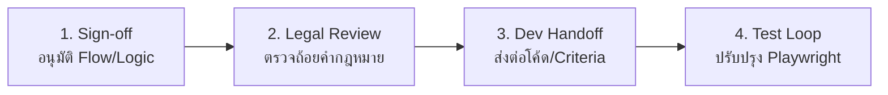

# สรุปและวิเคราะห์ไฟล์ร่างพิมพ์เขียวการใช้งานผู้ใช้ (Foothold UX Journey Blueprint)

> แฟ้มอ้างอิง: [foothold-ux-journey.html](file:///D:/deploy/foothold/foothold-ux-journey.html)
> วันที่: 2026-07-29

เอกสารร่างต้นแบบนี้เป็น **"การตัดสินใจเชิงโครงสร้าง" (Structural Blueprint)** เพื่อจำลองเส้นทางการใช้งานผู้ใช้ (UX Journey) 12 ขั้นตอนสำหรับระบบตั้งหลัก โดยทำงานแบบ Vanilla JS (ไม่มีเฟรมเวิร์ก) ทำให้การแปลง Mockup ไปสู่โค้ดบนโปรดักชันจริงทำได้อย่างตรงไปตรงมา

---

## 🎨 สรุป 12 ขั้นตอนและเหตุผลเชิงออกแบบ (UX Step Rationales)

| ลำดับขั้นตอน | ชื่องานหน้าจอ (Route) | แนวทางการออกแบบและเหตุผล (Design Rationale) |
| :--- | :--- | :--- |
| **01. หน้าแรก** | `/` | เน้นปุ่มเริ่มทำงานเดี่ยว และแสดงป้ายความไว้วางใจ (ฟรี / ไม่เก็บข้อมูลส่วนบุคคล / ใช้เวลา 8-10 นาที) เพื่อลดความตื่นตระหนก |
| **02. ความยินยอม** | `/consent` | เน้นย้ำระบบประมวลผลฝั่ง Client (Local Sandbox) เพื่อสร้างความเชื่อมั่นในการปกป้องข้อมูลส่วนบุคคล (PDPA) |
| **03. เริ่มคำถามคัดกรอง** | `/triage/q1` | ระบบถาม-ตอบ 1 คำถามต่อหน้าจอเพื่อลดภาระทางความคิด (Cognitive Load) พร้อมแถบวัดความคืบหน้า |
| **04. ประเมินความเสี่ยง** | `/triage/risk-branch` | ปุ่ม Yes/No ขนาดใหญ่ตามตรรกะ Rule Engine แยกประเภทเส้นเงิน |
| **05. ตรวจสอบเลขคดี** | `/triage/case-id` | มีฟังก์ชันสำรองให้เลือก "ไม่มีเลขคดีในมือ" ป้องกันผู้ใช้ติดหล่มค้างหน้านั้น |
| **06. ผลการประเมิน** | `/result` | ใช้การแยกกลุ่มความเร่งด่วนด้วยสีสัญญาณไฟจราจร (แดง / เหลือง / เขียว) เพื่อให้เข้าใจทันที |
| **07. กรอบเวลา** | `/result/timeline` | เส้นประวัติแนวนอนระบุหน่วยเป็น "วัน" เพื่อให้เห็นกรอบที่ต้องเดินทางไปทำธุรกรรม/คดีจริง |
| **08. เลือกประเภทเอกสาร** | `/documents/select` | ไฮไลต์เอกสารแนะนำ แต่ผู้ใช้ยังคงมีสิทธิ์ในการเลือกฉบับอื่นได้อิสระ |
| **09. กรอกข้อเท็จจริง** | `/documents/facts` | ใส่ Hint Chips นำทางในการเขียนเล่าเรื่อง (เกิดเมื่อไร / ธนาคารใด / ทำอย่างไร) แทนช่องพิมพ์เปล่า |
| **10. เลือกโทนเอกสาร** | `/documents/tone` | มีระบบ Live Preview แสดงตัวอย่างประโยคจริงสลับตามโทนที่เลือก (3 Tones) ทันที |
| **11. ตรวจทาน & โหลด** | `/documents/review` | แสดงตัวอย่างจดหมายในสัดส่วนกระดาษจริง เพื่อแยกแยะออกจากปุ่มควบคุมการแก้ไข |
| **12. สรุปและติดตามผล** | `/summary` | แสดงเช็กลิสต์รายการสิ่งที่ผู้ใช้ต้องทำต่อ (Actionable Checklist) ในชีวิตจริง |

---

## 🚦 4 ขั้นตอนก่อนส่งเข้าระบบพัฒนาจริง (Development Handoff Process)

เพื่อให้พิมพ์เขียว UX นี้เชื่อมต่อเข้ากับท่อส่งของนักพัฒนา (CI/CD Pipeline) ได้อย่างปลอดภัย ควรดำเนินงาน 4 ขั้นตอนดังนี้:

### 1️⃣ Sign-off (การอนุมัติโครงสร้าง)
*   **เป้าหมาย:** ส่งมอบไฟล์ต้นแบบนี้ให้ทีมงานตรวจยืนยันตรรกะการแยกเส้นคดี (Branching Logic) ในขั้นตอนที่ 4-8 ว่าสอดคล้องกับตรรกะของระเบียบกฎหมายหรือไม่
*   **จุดเน้น:** เน้นพิจารณา Flow และ Logic ไม่เน้นเรื่องโทนสีหรืองานศิลป์

### 2️⃣ Legal Review (การตรวจความถูกต้องทางกฎหมาย)
*   **เป้าหมาย:** นำถ้อยคำตัวอย่างจดหมายชี้แจงในขั้นตอนที่ 10 (Tone Builder) และขั้นตอนที่ 9 (Fact Statement) ส่งต่อให้ฝ่ายกฎหมายหรือทีมตรวจสอบความถูกต้องของ ปปง. (Compliance) ตรวจร่างก่อน
*   **ความสำคัญ:** ป้องกันความเสี่ยงจากการที่ระบบร่างเอกสารที่อาจทำให้รูปคดีของผู้ใช้เสียเปรียบ

### 3️⃣ Dev Handoff (ตั๋วงานสำหรับนักพัฒนา)
*   **เป้าหมาย:** แตกย่อยงานออกเป็น 12 ชิ้นงานย่อย (Components) ตามหน้าจอต้นแบบ พร้อมแนบ Acceptance Criteria ของแต่ละหน้าจอส่งมอบให้นักพัฒนา
*   **ข้อดี:** โค้ดต้นแบบเป็น Vanilla JS ซึ่งสามารถนำไปประกบสไตล์ใน `tanglak.html` ปัจจุบันได้ง่ายดาย

### 4️⃣ Test Loop (ลูปการทดสอบอัตโนมัติ)
*   **เป้าหมาย:** เพิ่ม Test Cases และ Assertions ใหม่ในไฟล์ทดสอบระบบ [test_flow.py](file:///D:/deploy/foothold/test_flow.py) เพื่อให้ครอบคลุมการเปลี่ยนผ่านของสเตต (State transitions) ทั้ง 12 หน้าจอ
*   **ผลลัพธ์:** ป้องกันการเกิดผลกระทบตกค้าง (Regression) เมื่อขึ้นโปรดักชันจริงผ่าน Netlify

---

## 📈 ข้อมูลเชิงลึกสำหรับเวอร์ชัน UX v3.2-draft
*   **Baseline Lock:** แนะนำให้ล็อกรุ่นโมเดลนี้เป็นรุ่น `UX v3.2-draft` เพื่อเป็นตัวเปรียบเทียบมาตรฐาน (Baseline) ก่อนเริ่มแก้ไขไฟล์ `tanglak.html`
*   **Feedback Loop:** กำหนดรอบรีวิวความถูกต้องของ UI/UX ที่แปลงจาก Mockup ไปใช้งานจริง 1 รอบหลังการพัฒนาเสร็จสิ้น
